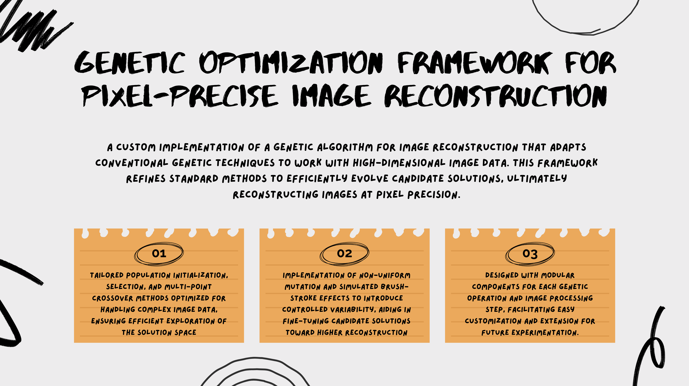
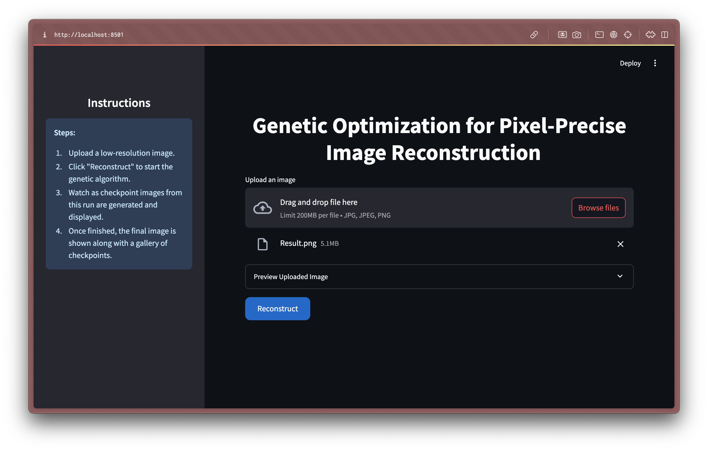
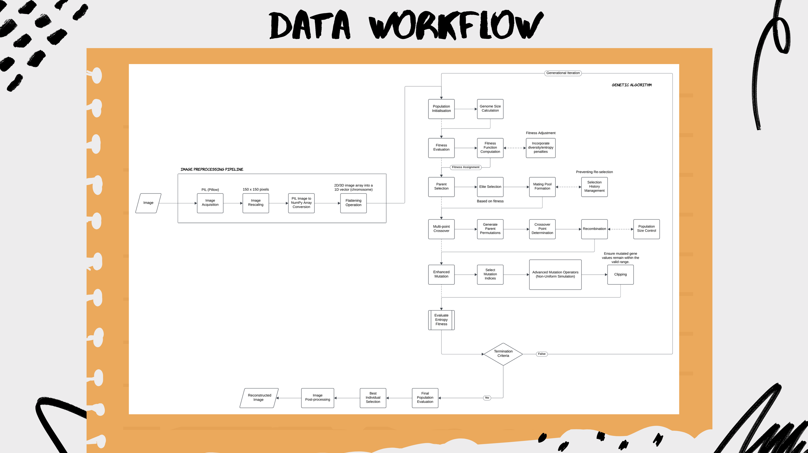

# Genetic Optimization Framework for Pixel-Precise Image Reconstruction

The **Genetic Optimization Framework for Pixel-Precise Image Reconstruction** is a custom implementation of a genetic algorithm designed specifically for image reconstruction. Although based on standard genetic algorithm techniques, this framework adapts and refines conventional methods to efficiently evolve candidate solutions, achieving pixel-level reconstruction accuracy.



This repository contains all the scripts required for running inference through a Streamlit-based UI and includes a Docker setup for simplified deployment.


## File Requirements

For running inference using the Streamlit UI, the following data files and directories are required:
- **Input Images:** Low-resolution images (JPG, JPEG, or PNG) should be placed in `data/raw`
- **Processed Data & Checkpoints:** The reconstructed images and checkpoint images will be saved in `data/processed`  
  - Final reconstructed image is saved as `solution.png`
  - Intermediate checkpoint images are saved in `data/processed/checkpoint`

## Features

- **Customized Genetic Operations:**  
  Tailored population initialization, selection, and multi-point crossover methods optimized for handling complex, high-dimensional image data, ensuring efficient exploration of the solution space.

- **Enhanced Mutation Strategies:**  
  Implementation of non-uniform mutation and simulated brush-stroke effects introduces controlled variability, helping fine-tune candidate solutions to achieve higher reconstruction fidelity.

- **Modular and Lightweight Architecture:**  
  The framework is designed with modular components for each genetic operation and image processing step, facilitating easy customization and extension for future experimentation.

- **Interactive Reconstruction Inference:**
  - **Streamlit-Based UI:** An interactive interface for uploading an image and visualizing the reconstruction process.
  - **Live Progress Updates:** Displays a loading UI with periodic updates of the latest checkpoint image.
  - **Side-by-Side Comparison:** Compares a resized version of the original input image with the final reconstructed image.


## Installation and Setup

1. Clone the repository and Navigate to root directory.
2. Run the following command to build the Docker image and start the application:
    ```bash
    docker compose up --build
    ```
3. Open your browser and navigate to
    ```bash
    http://localhost:8501
    ```
    


## How to Run

### Inference Using the Streamlit App

1. **Upload an Image:**
   - Navigate to the Streamlit UI in your browser (e.g., `http://localhost:8501`).
   - Upload a low-resolution image.

2. **Run Reconstruction:**
   - Click the **"Reconstruct"** button to start the genetic algorithm.
   - Watch as the app displays a loading UI and periodically updates with the latest checkpoint image from `data/processed/checkpoint`.

3. **View Final Output:**
   - Once the genetic algorithm completes, the final reconstructed image is saved as `solution.png` in `data/processed` and displayed alongside a side-by-side comparison with the resized original image.


## Technology Stack




## Troubleshooting

- **Final Image Not Being Saved:**
  - Ensure that the `data/processed` folder exists and is writable.
  - Old checkpoint files are cleared automatically before a new run; if issues persist, manually delete `data/processed` contents.

- **UI Issues:**
  - If the Streamlit app does not render correctly, clear your browser cache or try a different browser.

- **Performance Issues:**
  - Genetic algorithm inference can be slow. Consider resizing input images or adjusting genetic parameters for faster convergence.


## Legal Attribution

This project builds upon the classical genetic algorithm framework, which has been widely studied and implemented. Our custom modifications for image reconstruction are an original extension of standard techniques, aiming to deliver pixel-precise results. While the genetic algorithm concept is well-established, our specific approach for image reconstruction and the enhancements implemented in this project are released under the MIT License.

This project also builds upon ideas and inspiration from the work by Ahmed Gad for image reconstruction using a basic genetic algorithm, which is available under the MIT License. The original repository can be found on GitHub. Portions of this code were adapted from that implementation.

```
MIT License

Copyright (c) 2020 Ahmed Fawzy Mohamed Gad

Permission is hereby granted, free of charge, to any person obtaining a copy of this software and associated documentation files (the "Software"), to deal in the Software without restriction, including without limitation the rights to use, copy, modify, merge, publish, distribute, sublicense, and/or sell copies of the Software, and to permit persons to whom the Software is furnished to do so, subject to the following conditions:

The above copyright notice and this permission notice shall be included in all copies or substantial portions of the Software.

THE SOFTWARE IS PROVIDED "AS IS", WITHOUT WARRANTY OF ANY KIND, EXPRESS OR IMPLIED, INCLUDING BUT NOT LIMITED TO THE WARRANTIES OF MERCHANTABILITY, FITNESS FOR A PARTICULAR PURPOSE AND NONINFRINGEMENT. IN NO EVENT SHALL THE AUTHORS OR COPYRIGHT HOLDERS BE LIABLE FOR ANY CLAIM, DAMAGES OR OTHER LIABILITY, WHETHER IN AN ACTION OF CONTRACT, TORT OR OTHERWISE, ARISING FROM, OUT OF OR IN CONNECTION WITH THE SOFTWARE OR THE USE OR OTHER DEALINGS IN THE SOFTWAR
```

For further reading on genetic algorithms, see:
- Goldberg, D. E. Genetic Algorithms in Search, Optimization, and Machine Learning.

---

